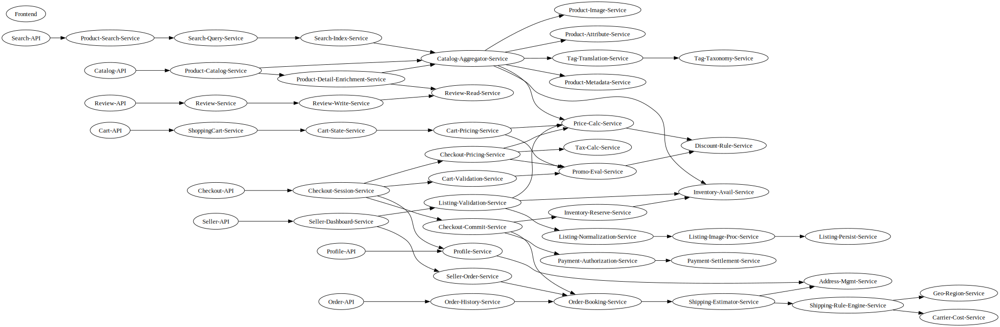

# Microservice Architecture Documentation

**Total Services:** 52

## Service Catalog

### Infrastructure
*Core UI layer (no direct calls to internal services)*

- **Frontend**

### External Apis
*Public API entry points owning external endpoints*

- **Catalog-API**
- **Cart-API**
- **Checkout-API**
- **Order-API**
- **Profile-API**
- **Seller-API**
- **Review-API**
- **Search-API**

### Product Catalog
*Product data, pricing, tags, and availability*

- **Product-Catalog-Service**
- **Catalog-Aggregator-Service**
- **Product-Metadata-Service**
- **Product-Image-Service**
- **Product-Attribute-Service**
- **Tag-Translation-Service**
- **Tag-Taxonomy-Service**
- **Price-Calc-Service**
- **Discount-Rule-Service**
- **Inventory-Avail-Service**
- **Product-Detail-Enrichment-Service**

### Shopping Cart
*Cart persistence, totals, promotions*

- **ShoppingCart-Service**
- **Cart-State-Service**
- **Cart-Pricing-Service**
- **Promo-Eval-Service**

### Search
*Keyword & facet search pipeline*

- **Product-Search-Service**
- **Search-Query-Service**
- **Search-Index-Service**

### Checkout
*End-to-end checkout flow and order booking*

- **Checkout-Session-Service**
- **Cart-Validation-Service**
- **Checkout-Pricing-Service**
- **Tax-Calc-Service**
- **Inventory-Reserve-Service**
- **Checkout-Commit-Service**
- **Order-Booking-Service**

### Payments
*Internal mock payment processing*

- **Payment-Authorization-Service**
- **Payment-Settlement-Service**

### Shipping
*Shipping cost and rule evaluation*

- **Shipping-Estimator-Service**
- **Shipping-Rule-Engine-Service**
- **Geo-Region-Service**
- **Carrier-Cost-Service**

### Orders
*Customer order history*

- **Order-History-Service**

### User Profile
*User profile and addresses*

- **Profile-Service**
- **Address-Mgmt-Service**

### Seller
*Marketplace seller tooling*

- **Seller-Dashboard-Service**
- **Listing-Validation-Service**
- **Listing-Normalization-Service**
- **Listing-Image-Proc-Service**
- **Listing-Persist-Service**
- **Seller-Order-Service**

### Reviews
*Product reviews storage and retrieval*

- **Review-Service**
- **Review-Write-Service**
- **Review-Read-Service**

## Service Dependency Graph

## Architecture Notes

- **Frontend**: UI-only layer with no direct internal service calls
- **External APIs**: Dedicated root services owning public endpoints
- **Payment Flow**: Split into Authorization → Settlement for traceability
- **Scope**: Synchronous calls only; databases/caching/async patterns excluded
