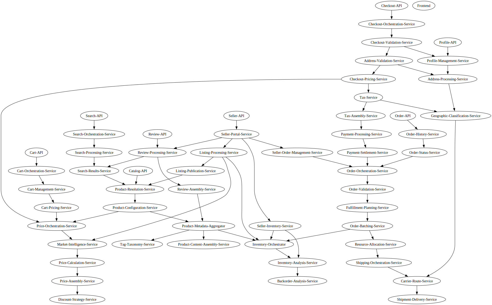

# Microservice Architecture Documentation

**Total Services:** 26

## Service Catalog

### Infrastructure
*Core UI layer (no direct calls to internal services)*

- **Frontend**

### External Apis
*Public API entry points owning external endpoints*

- **Catalog-API**
- **Cart-API**
- **Checkout-API**
- **Order-API**
- **Profile-API**
- **Seller-API**
- **Review-API**
- **Search-API**

### Product Catalog
*Consolidated product resolution and content assembly*

### Dynamic Pricing
*Market-based pricing without personalization*

- **Price-Orchestration-Service**
- **Market-Intelligence-Service**
- **Price-Calculation-Service**
- **Price-Assembly-Service**
- **Discount-Strategy-Service**

### Shopping Cart
*Consolidated cart management with pricing*

- **Cart-Orchestration-Service**
- **Cart-Management-Service**
- **Cart-Pricing-Service**

### Search
*Consolidated search processing and results*

- **Search-Orchestration-Service**
- **Search-Processing-Service**
- **Search-Results-Service**

### Checkout
*Complex checkout with validation and coordination*

### Order Management
*Complex order processing and fulfillment*

### User Profile
*Consolidated user profile and address processing*

- **Profile-Management-Service**
- **Address-Processing-Service**
- **Address-Standardization-Service**
- **Geographic-Classification-Service**

### Seller
*Seller tools with listing management*

### Reviews
*Consolidated review processing*

- **Review-Processing-Service**
- **Review-Assembly-Service**

## Service Dependency Graph

## Architecture Notes

- **Frontend**: UI-only layer with no direct internal service calls
- **External APIs**: Dedicated root services owning public endpoints
- **Payment Flow**: Split into Authorization → Settlement for traceability
- **Scope**: Synchronous calls only; databases/caching/async patterns excluded
