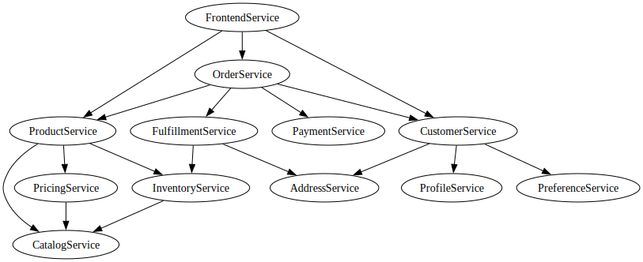

# E-commerce Service Graph

E-commerce microservices architecture with frontend handling HTTP endpoints

## Service Graph Visualization

The service graph shows the hierarchical relationships between services in our e-commerce microservice architecture.

## Service Overview

The service graph contains **12 services** organized into **4 categories**.

| Service | Category | Description | Endpoints |
|---------|----------|-------------|-----------|
| FrontendService | frontend | Frontend API gateway handling all HTTP endpoints | GET /products, GET /products/{id} (+10 more) |
| OrderService | core | Order management and processing | CreateOrder, GetOrder (+3 more) |
| FulfillmentService | core | Order fulfillment and shipping | ProcessFulfillment, GetFulfillment |
| ProductService | core | Product management | GetProduct, SearchProducts (+2 more) |
| CatalogService | product | Product catalog and information | GetProduct, SearchProducts (+1 more) |
| InventoryService | product | Inventory management and stock control | GetInventory, UpdateInventory (+1 more) |
| PricingService | product | Pricing calculation and management | CalculatePrice, GetPricingRules |
| CustomerService | core | Customer management | GetCustomer, CreateCustomer (+2 more) |
| ProfileService | customer | Customer profile management | GetProfile, CreateProfile (+1 more) |
| AddressService | customer | Customer address management | GetAddresses, CreateAddress (+1 more) |
| PreferenceService | customer | Customer preferences and settings | GetPreferences, UpdatePreferences |
| PaymentService | core | Payment processing and transactions | ProcessPayment, GetPayment |

## Service Categories

### Frontend API gateway

**Services:** FrontendService

**Count:** 1 services

### Core business services

**Services:** OrderService, FulfillmentService, ProductService, CustomerService, PaymentService

**Count:** 5 services

### Product-related services

**Services:** CatalogService, InventoryService, PricingService

**Count:** 3 services

### Customer management services

**Services:** ProfileService, AddressService, PreferenceService

**Count:** 3 services

## Dependency Analysis

### Services by Dependency Count

| Service | Dependencies |
|---------|-------------|
| FrontendService | 5 |
| OrderService | 4 |
| ProductService | 3 |
| CustomerService | 3 |
| FulfillmentService | 2 |
| InventoryService | 1 |
| PricingService | 1 |
| CatalogService | 0 |
| ProfileService | 0 |
| AddressService | 0 |

### Most Dependent Services

These services have the most dependencies: FrontendService, OrderService, ProductService, CustomerService, FulfillmentService

### Leaf Services

These services have no dependencies: CatalogService, ProfileService, AddressService, PreferenceService, PaymentService

## Workflow Templates

### Order Processing

**Description:** Complete order processing workflow

**Root Service:** FrontendService

**Required Services:** OrderService, ProductService, CustomerService, PaymentService

**Optional Services:** FulfillmentService

### Product Search

**Description:** Product search and discovery

**Root Service:** FrontendService

**Required Services:** ProductService, CatalogService, InventoryService, PricingService

**Optional Services:** 

### Customer Registration

**Description:** Customer registration and profile setup

**Root Service:** FrontendService

**Required Services:** CustomerService, ProfileService, AddressService, PreferenceService

**Optional Services:** 

## Usage

This service graph can be used to:

1. **Generate realistic workflows** by traversing service dependencies
2. **Analyze service relationships** and identify coupling points
3. **Plan microservice architecture** with proper service boundaries
4. **Create distributed tracing scenarios** for research and testing

## Service Graph Structure

- **Frontend Services**: HTTP API gateway handling external requests
- **Core Services**: Main business logic services (OrderService, CustomerService, etc.)
- **Product Services**: Product catalog, inventory, and pricing services
- **Customer Services**: User management and profile services

## Workflow Generation

The service graph supports workflow generation through:

- **Template-based generation**: Use predefined workflow templates
- **Dependency traversal**: Follow service dependencies to create realistic call chains
- **Complexity profiles**: Control workflow depth and breadth
- **Business context**: Ensure workflows represent realistic business processes

