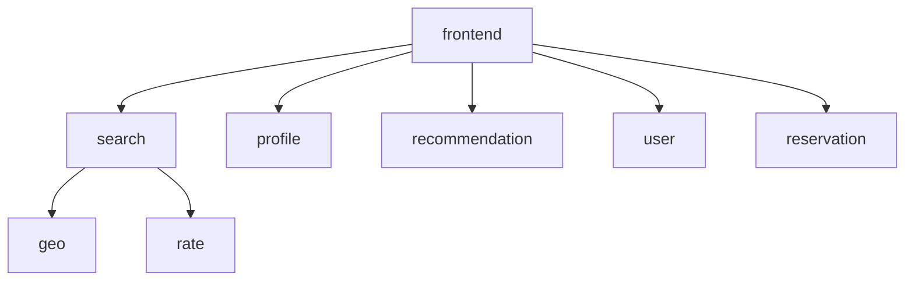

# DeathStarBench Hotel Reservation

This Blueprint translation has eight services, six MongoDB backends, and three
memcached backends. Search, recommendation, login, and reservation are exposed
through the HTTP frontend; internal calls use gRPC.



All eight services export through the custom OpenTelemetry collector to Jaeger.
Kubernetes uses the same collector DaemonSet with `internalTrafficPolicy: Local`
as social network, so each application pod reaches its node's collector. The
collector also exposes SDK configuration discovery on port 8080.

## State of the application

The service implementations and tests cover all four frontend flows. Concurrent
availability statistics use atomic increments, and search propagates reservation
service failures. The rate service still has an existing sorting TODO; this
remains a synthetic benchmark with simplified date and reservation handling.

Constructors automatically seed 80 hotel profiles and the `Cornell_N` users,
including `Cornell_1` / `1111111111`. No separate seed step is needed. Initialization
inserts data again when a backend service restarts against an existing database.
Generated MongoDB and Elasticsearch containers have ephemeral storage; this
wiring does not provide persistent volumes or restart-safe initialization.
Use fresh backends for clean benchmark runs.

## One-shot build and deployment

From the repository root, after environment setup:

```bash
utils/build_deploy_hotel.sh --help

# Generate, build/push images, deploy, and wait for readiness.
utils/build_deploy_hotel.sh -s docker_cgpb_es -n cgpb_es_run1 \
  --cpd 2 --gc natural --collector passthrough \
  --frontend-deploy --nodeport --apply
```

The script sources `~/.profile` and activates the repository's `.venv`. It
generates the application, runs `goimports`, configures the collector and service
environments, converts Compose with `d2k8s`, builds/pushes images, and optionally
applies the result. Build failures and readiness timeouts fail the command.

Output defaults to `examples/dsb_hotel/build_<name>/`; `--output` overrides it.
The output directory must not already exist. `-n` selects only the directory;
`--extra rev2` changes resource/image names. For example, `docker_sb_es --extra
rev2` creates `frontend-service-hotel-sb-esrev2-ctr` and
`otelcol-hotel-sb-esrev2-ctr`.

| Wiring spec | SDK processor | Jaeger storage |
| --- | --- | --- |
| `docker_pb`, `docker_pb_es` | Path bridge | Memory / Elasticsearch |
| `docker_cgpb`, `docker_cgpb_es` | Call-graph path bridge | Memory / Elasticsearch |
| `docker_sb`, `docker_sb_es` | Structural bridge | Memory / Elasticsearch |
| `docker_v`, `docker_v_es` | Vanilla | Memory / Elasticsearch |
| `docker_rc_es` | Random-checkpoint control | Elasticsearch |

`OT_BRIDGE` at generation time and `BRIDGE_KIND` at runtime both follow the spec.
The default is `docker_cgpb_es`.
The random-checkpoint control does not support `--reverse-truss`.

Useful options:

- `--registry HOST:PORT`, `--image-tag TAG`: image destination, defaulting to
  `10.10.1.1:30000` and `latest`. `--skip-build` generates manifests without
  building/pushing; applying them requires images with that tag to exist.
- `--build-collector`: build/push the sibling `opentelemetry-collector-contrib`
  first, using `go1.24.13` for its older dependencies. Override with
  `--collector-src`, `--collector-toolchain`, or `--collector-image`.
- `--collector default`: priority admission for bridge/control variants, memory
  limiting plus batching for vanilla. `--soft`, `--hard`, and `--cp-safety`
  configure the priority controller (defaults 50, 70, and 1).
- `--collector passthrough`: batching without collector shedding, matching social
  network overhead experiments. `--cpd N` sets SDK checkpoint distance through
  configuration discovery in either mode. `--collector-config FILE` overrides
  the checked-in collector configuration.
- `--gc natural|forced`: ordinary Go GC, or `GOGC=off` with forced GC every 100ms
  (the social network default). SDK export retries are disabled in both modes.
  `--sample-ratio` controls head sampling; `--rpc-timeout` defaults to `5s`.
- `--frontend-deploy`: one frontend Deployment. Otherwise the frontend is a
  DaemonSet with normal cluster routing; only the collector uses Local routing.
- `--one-per-node`: place the eight services on distinct ready, schedulable nodes,
  with databases/caches beside their service; implies `--frontend-deploy`.
  Alternatively use `--node-pinning FILE` with `--frontend-deploy`; its format
  matches `utils/pin_nodes.py`. `--no-pin-requests` ignores resources in that file.
- `--namespace`: defaults to `dsb-hotel`. Resource names also include `hotel`.
  Applying hotel does not delete existing hotel variants or social network
  resources. Remove an old build with `kubectl delete -f OLD_BUILD/k8s/` when
  switching experiments.
- `--nodeport [PORT]`: expose the frontend, allocating a port unless specified.
  `--wait-timeout` defaults to five minutes per workload.

Collector pods use social network's performance defaults: one CPU, 4Gi memory,
and `GOMEMLIMIT=3276MiB`. Jaeger gets the same queue and Elasticsearch bulk-write
tuning. Workloads have startup/readiness probes; databases and caches remain
single replicas.

## Reverse checkpoints

Tomislav-RetCtx: the same SDK leaf rejection and per-truss return routing are
available in Hotel Reservation's generated instrumentation.

```bash
utils/build_deploy_hotel.sh -s docker_cgpb_es -n cgpb_reverse \
  --extra reverse --cpd 2 --collector passthrough --gc natural \
  --reverse-truss --rt-leaf-reject 1 \
  --frontend-deploy --apply
```

Reverse-context settings are written into Compose and Kubernetes for every
application service, with `RT_ROOT=on` only at the frontend. `--rt-leaf-reject`
defaults to zero; one rejects unscheduled leaves. Original forward checkpoints
are retained. Each returned truss draws its reverse TTL from `--cpd`, or from
`--cpd-min`/`--cpd-max` when using a range. Old `--rt-policy`/`--rt-depth` arguments
are deprecated and no longer control SDK routing.
See [SDK policy details](../../docs/dev/reverse_truss.md).

Tomislav-RetCtx: add `--reverse-policy inverse_depth` for a per-truss `1/n`
acceptance chance, or `--reverse-policy depth_linear` to favor deeper receivers.
For fixed p, use `--reverse-policy probability --reverse-probability 0.25`.
The default remains TTL; all modes preserve original forward checkpoints.
See [the probability policy guide](../../docs/dev/reverse_checkpoint_probability.md).

## Access and verify

For `docker_cgpb_es` without an extra suffix:

```bash
kubectl -n dsb-hotel port-forward service/frontend-service-hotel-cgpb-es-ctr 9000:2000
# In another shell:
kubectl -n dsb-hotel port-forward service/jaeger-hotel-cgpb-es-ctr 16686:16686
```

Open Jaeger at `http://localhost:16686`. Exercise the frontend with:

```bash
curl -fsS 'http://localhost:9000/UserHandler?username=Cornell_1&password=1111111111'
curl -fsS 'http://localhost:9000/SearchHandler?customerName=Test&inDate=2015-04-09&outDate=2015-04-10&lat=37.7835&lon=-122.41&locale=en'
curl -fsS 'http://localhost:9000/RecommendHandler?lat=37.7835&lon=-122.41&require=dis&locale=en'
# Creates one reservation:
curl -fsS 'http://localhost:9000/ReservationHandler?inDate=2015-04-09&outDate=2015-04-10&hotelId=1&customerName=Test&username=Cornell_1&password=1111111111&roomNumber=1'
```

Responses contain `Ret0` (the result) and `Ret1` (reverse context). Search and
recommendation return profiles; login and reservation return `Login successful`
and `Reservation successful`. These are Blueprint's method-based URLs; upstream
DeathStarBench HTTP load scripts need their URLs adapted.

```bash
source ~/.profile
source .venv/bin/activate
go test -race ./examples/dsb_hotel/tests ./examples/dsb_hotel/wiring/...
python -m unittest discover -s utils -p 'test_build_deploy_hotel.py'
```

## Direct generation and Docker Compose

```bash
source ~/.profile
source .venv/bin/activate
hotel_out="$(mktemp -d)/app"
go run ./examples/dsb_hotel/wiring -w docker_cgpb_es -o "$hotel_out"
goimports -w "$hotel_out/docker"
cp "$hotel_out/.local.env" "$hotel_out/docker/.env"
docker compose -f "$hotel_out/docker/docker-compose.yml" up --build -d
```

The `.env` file assigns local host ports. Use `docker compose ... port
frontend_service_hotel_cgpb_es_ctr 2000` to find the frontend port. Direct
generation uses the checked-in collector defaults; the one-shot script also
applies the tuning and deployment options above.

`-w original` remains available with its original service names and workload
driver, now exporting through otelcol. Other specs can include the driver with
`-with-workload`. The driver and generated Go tests live outside Compose, so
they do not start automatically with the application.
