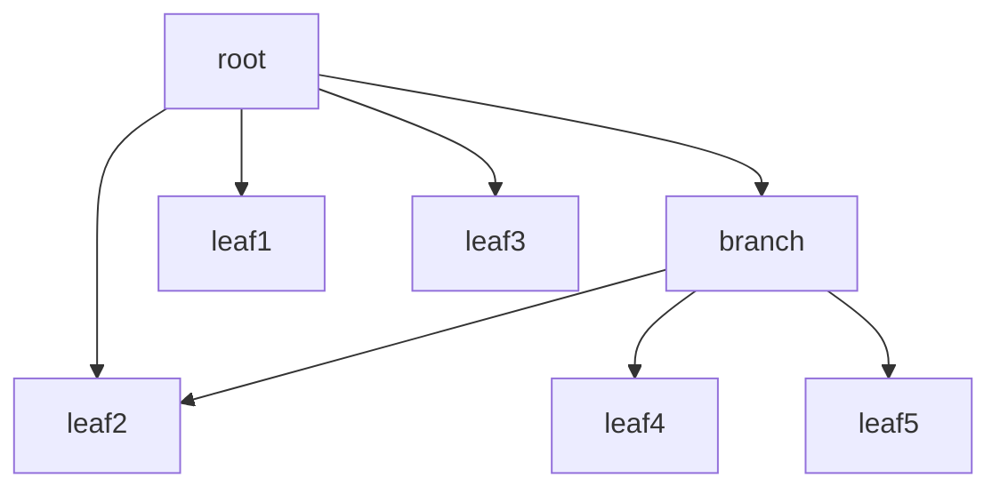
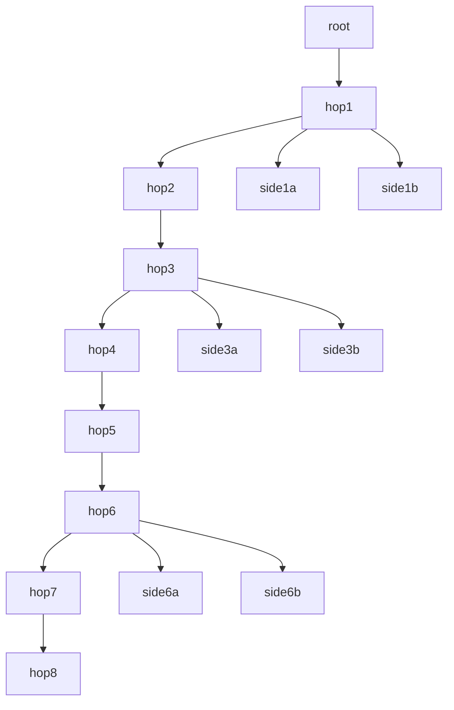

# Configurable fan-out services

Tomislav-RetCtx: the `docker_fanout` wiring spec builds a synthetic application from a JSON or
YAML topology and its call patterns. Graphs can contain arbitrary fan-out,
nested branches, shared downstream services, and repeated calls. The graph
must be acyclic and reachable from one root.

The [schema](wiring/specs/topology.schema.json) describes version 1. `version`
is optional for compatibility with existing files. An optional `$schema`
property is editor metadata; the compiler does not fetch it.

Each call passes `n` unchanged to every child and sums the results. A node with
no children returns `n + 1`. A shared service handles a separate request for
each incoming call; sharing does not deduplicate calls.

## Topology and concurrency

[wiring/specs/fanout.json](wiring/specs/fanout.json) is the default topology:



The root runs all four children concurrently. The branch calls its three
children with at most two calls active at once. There are seven services and
six leaf calls per request, so `Process(7)` returns `48`.

The file has a `root` name and a `nodes` object keyed by service name. Each node
has an optional `children` array and an optional `parallelism` integer:

| `parallelism` | Execution within one request |
| --- | --- |
| `0` or omitted | All children may run concurrently |
| `1` | Sequential, in child-list order |
| `N > 1` | At most `N` child calls at a time |

Limits apply separately to each request. A service can handle multiple parent
requests concurrently. With no children, `{}` defines a leaf.

Node names start with a lowercase letter and contain lowercase letters, digits,
or underscores. The builder validates unknown fields, missing children,
negative limits, cycles, and nodes unreachable from the root before wiring.
Topology and limits are selected when generating the application; regenerate
and rebuild after changing them.

## Eight-hop topology

[deep8.yaml](wiring/specs/deep8.yaml) has a longest path of eight service-to-service
RPC hops, or nine services including the root. Three fan-out points sit at
service depths 1, 3, and 6, counting the root as depth 0:



| Service | Calls | Parallelism |
| --- | --- | --- |
| `hop1` | `hop2`, `side1a`, `side1b` | All three concurrent |
| `hop3` | `hop4`, `side3a`, `side3b` | At most two concurrent |
| `hop6` | `hop7`, `side6a`, `side6b` | Sequential, in that order |

The application has 15 services, 14 RPCs and seven leaf calls per successful
request, so `Process(7)` returns `56`. The transport timeout is `10s` to allow
the deeper chain to finish. Generate it with
`-topology examples/leaf/wiring/specs/deep8.yaml` in the command below.

## Composed call patterns

Use a node's `pattern` field to describe its behavior instead of `children` and
node-level `parallelism`. Patterns compose recursively, so sequences may contain
parallel groups, and parallel branches may contain sequences or repetitions:

```yaml
version: 1
root: frontend
rpc_timeout: 5s
nodes:
  frontend:
    pattern:
      sequence:
        - call: auth
          timeout: 500ms
        - parallel:
            - call: catalog
            - repeat:
                count: 3
                do:
                  sequence:
                    - sleep: 1ms
                    - call: inventory
          parallelism: 2
        - call: audit
  catalog:
    children: [inventory, pricing]
    parallelism: 0
  auth: {}
  inventory: {}
  pricing: {}
  audit: {}
```

This complete example is in [patterns.yaml](wiring/specs/patterns.yaml). It
generates six services and eight RPC calls per request. The inventory service
is called both through catalog and directly by frontend. There are seven plain
leaf calls, so `Process(7)` returns `56`.

| Pattern | Behavior |
| --- | --- |
| `call: service` | One RPC with the original `n`; optional positive `timeout` |
| `sequence: [...]` | Run steps in order, waiting for each; stop on the first error |
| `parallel: [...]` | Run branches and join them; optional `parallelism` bounds active immediate branches |
| `repeat: {count: N, do: ...}` | Execute the nested pattern `N` times sequentially; stop on error |
| `sleep: 5ms` | Wait locally, honoring cancellation; contributes zero to the result |

Groups and repetitions sum their results. Empty groups and zero repetitions
return zero. Inputs remain unchanged across steps; this models call behavior,
not dataflow between step results. `{}` remains a plain leaf returning `n + 1`.
A node may use either a pattern or the original children form. Dependencies are
derived from all nested `call` actions, with each target service deployed once.

`rpc_timeout` sets the transport deadline for each gRPC call (default `1s`). A
per-call `timeout` or an earlier parent deadline can shorten it. Set the transport
deadline high enough for downstream sequences, repetitions, and simulated work.
Timeouts cancel the call context; code and transports must honor cancellation.

Parallel groups finish their child calls and wrappers before returning an error
to a surrounding sequence. Sequential steps after that error do not run. Nested
parallel groups each have their own limit; the limit is not a global RPC budget.
Repetition counts calls rather than retrying failures. The current actions are
deterministic; probabilistic routing and business logic are not generated.

## Generate and build

From the repository root, with the environment setup completed:

```bash
source ~/.profile
source .venv/bin/activate

fanout_out="$(mktemp -d)/app"
OT_BRIDGE=cgpb go run ./examples/leaf/wiring \
  -w docker_fanout \
  -topology examples/leaf/wiring/specs/fanout.json \
  -o "$fanout_out"

# Prune unused imports from the generated tracing templates.
goimports -w "$fanout_out/docker"

# Compile every generated service without starting containers.
for proc_dir in "$fanout_out"/docker/node_*_ctr/node_*_proc; do
  proc_name="$(basename "$proc_dir")"
  (cd "$proc_dir" && go build -o service "./$proc_name")
done
```

Omit `-topology` to use the embedded default, or point it at any JSON or YAML file
using this schema. For the composed example, use
`-topology examples/leaf/wiring/specs/patterns.yaml`. Format detection uses the
contents, so the file extension is optional.
`OT_BRIDGE` accepts `pb`, `cgpb`, `sb`, and `v`; the default is `cgpb`. The wiring
sets the generated containers' `BRIDGE_KIND` to match the tracing wrappers.

The generated Docker Compose application is in `$fanout_out/docker`. It contains
one container per node, a collector, and Jaeger. The root serves HTTP
`/Process?n=7`; other nodes serve gRPC. Compose's required host-port variables
are listed in `docker-compose.yml`. Generated `main.go` files also list the
addresses needed to run each compiled service directly.

The collector defaults to `10.10.1.1:30000/otelcontribcol:latest`, built from the
sibling `opentelemetry-collector-contrib` project. Override it with
`-collector-image`. The included
[fanout-collector.yaml](wiring/specs/fanout-collector.yaml) exposes the SDK's
configuration discovery endpoint on port 8080 and sets checkpoint distance
`cpd: 1`. Use `-collector-config` to select another collector configuration.

For reverse-checkpoint experiments, configure `REVERSE_TRUSS=on` and the
`RT_LEAF_REJECT` probability in the service processes or containers, including
`RT_ROOT=on` at the root. Original checkpoints remain in place; rejected leaves
draw independent reverse TTLs from the collector's CPD configuration. Setting
these environment variables only in the shell that generates Compose
does not inject them into containers. See the
[SDK reverse-context implementation](../../docs/dev/reverse_truss.md).

Tomislav-RetCtx: custom collector YAML may also select `reverse_policy:
inverse_depth`, `depth_linear`, or `probability` with `reverse_probability`.
Those policies sample each returned truss independently; sibling paths keep
their own origin depths. See [probability routing](../../docs/dev/reverse_checkpoint_probability.md).

## Completion and reverse context

All child calls receive the parent request context, including its tracing
fan-in accumulator. Within a fan-out or parallel group, a child error does not
cancel its siblings. The group waits for its child calls and instrumentation
wrappers to finish, then returns either the sum or all child errors joined in
child-list order. A surrounding sequence stops after a failed group finishes.
Cancellation stops scheduling further children and waits for calls already started to exit;
children must honor cancellation for this wait to finish promptly.
With a timeout or transport failure, only bundles already returned to local
wrappers participate in fan-in.

Consequently, the enclosing server wrapper sees the complete set of returned
trusses before asking the SDK to prepare its checkpoint. Sibling trusses,
including bundles from deeper branches, are appended without changing their
origin span IDs, depths, bytes, or individual TTLs. Their order follows return
arrival. Tomislav-RetCtx: merging spends no hop; each receiving SDK span emits
expired trusses and decrements the remaining TTLs, or absorbs all returns if it
was an original forward checkpoint.

To construct nodes directly in a wiring spec, pass the limit followed by any
number of child service names:

```go
root := workflow.Service[*leaf.FanoutNodeImpl](spec, "root", "0", a, b, c, d)
```

Blueprint's constructor binding supports variadic dependencies, so this does
not require a separate Go implementation for each fan-out width.

```bash
go test -race ./examples/leaf/workflow/leaf ./examples/leaf/wiring/specs \
  ./plugins/opentelemetry ./test/wiring
```

Tests cover arbitrary widths, actual concurrent execution, bounded concurrency,
multiple requests, cancellation, error draining, JSON/YAML equivalence, topology
and pattern validation, ordered execution, repetition, variadic wiring, and
fan-in through all four generated tracing wrappers.
